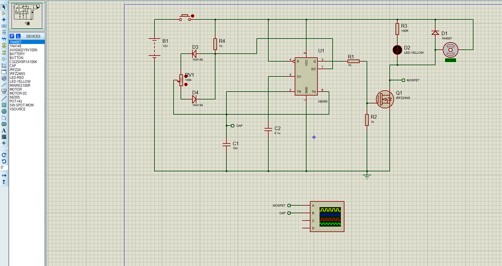
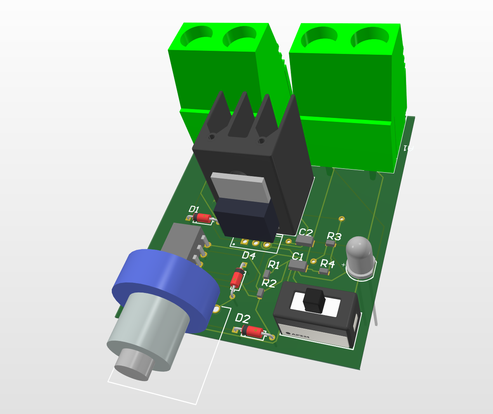

cat > README.md << EOF
# Contrôle de vitesse d'un moteur DC 12V via NE555 (PWM)

## Objectif

Commander la vitesse d'un moteur DC 12V à l'aide d'un potentiomètre, en générant un signal PWM avec un NE555 en mode astable.

## Principe de fonctionnement

- Le NE555 est configuré en mode astable pour générer un signal PWM.
- Un potentiomètre ajuste le rapport cyclique du PWM.
- Un MOSFET IRFZ44N commute le moteur en fonction du signal PWM.
- Une diode de roue libre protège le circuit contre les surtensions.

## Schéma électrique

Le schéma ci-dessous montre :
- Le NE555 (U1) en mode astable.
- Le potentiomètre PV1 pour régler le rapport cyclique.
- Le MOSFET Q1 (IRFZ44N) et la diode D1 (1N4007).

## PCB

Conception du PCB sous [Altium / KiCad / Proteus – à préciser].

## Réalisation et résultats

- Prototype réalisé et testé sur banc.
- Réglage de la vitesse via le potentiomètre validé.

## Améliorations possibles

- Ajout d'un affichage de la vitesse (potentiomètre + ADC + microcontrôleur).
- Protection contre les surintensités.
- Boîtier 3D imprimé.

## Fichiers du projet

- \`hardware/schematics/\` : schémas électriques.
- \`hardware/pcb/\` : fichiers et exports du PCB.
- \`assets/photos/\` : photos du montage.
- \`docs/\` : notes, calculs, simulations.
EOF
